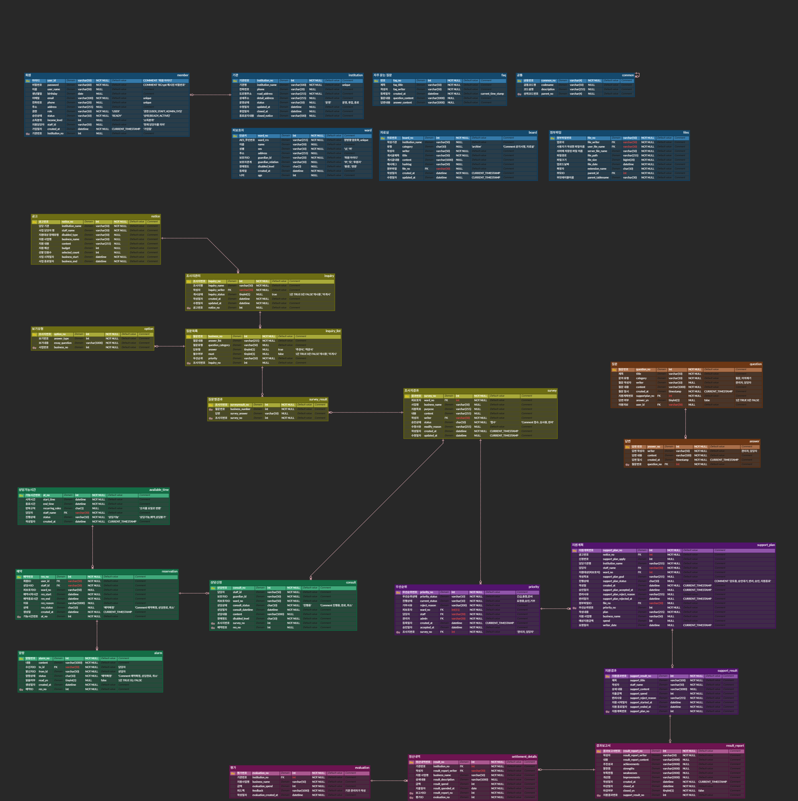
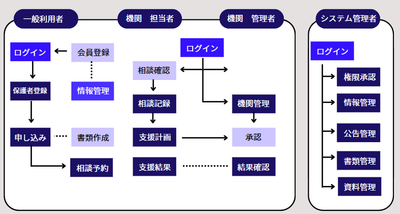

# 発達障害者の待機者支援プログラム

## 📋 プロジェクト概要

- 発達障害者が最も必要とする瞬間に適切な支援を提供できるシステムを構築しようとしました。

- オンラインベースの運営によってアクセシビリティを高め、直接対面が必要な時間とコストを削減することを目指しました。

- また、紙の書類作成を最小限に抑えることで、機関の担当者や管理者の業務効率を向上させる効果が期待できると予測しました。

---

## 🛠️ 環境

| 区分 | 使用技術 |
|------|----------|
| 分析・設計 | Figma, ERD Cloud, Google Workspace |
| IDE | Visual Studio Code |
| ソースコード管理 | GitHub |
| データベース | MariaDB |
| デプロイ | GitHub Actions, NAVER Cloud |
| フロントエンド | Vue.js, PrimeVue, HTML, CSS, JavaScript |
| バックエンド | Node.js, Express, JavaScript |

---

## 📊 ERD図

> 総テーブル数：24個

---

## 🗺️ サイト構成図

---

## 👥 チーム役割

> ※ 個人情報保護のため、一部メンバーはイニシャルで表記しています。

| メンバー | 担当内容 |
|----------|----------|
| **キム・ドンウ** | **DBクラウドサーバー構築・管理／会員登録／機関登録／事業公告管理／権限承認ページ** |
| BJ | チームリーダー／機関担当者／機関管理者／業務処理プロセス |
| PS | サブリーダー／ログイン／スケジュール予約／相談管理 |
| PH | 開発環境構築・管理／調査票管理／Q&A／資料室 |
| KH | GitHub作成・管理／マイページ／機関ステータス変更 |

---

## 🎬 実演動画

**YouTubeリンク:** [発達障害者の待機者支援プログラム](https://youtu.be/3tPxfIJvv7o)

---

## 📁 担当機能のディレクトリ

